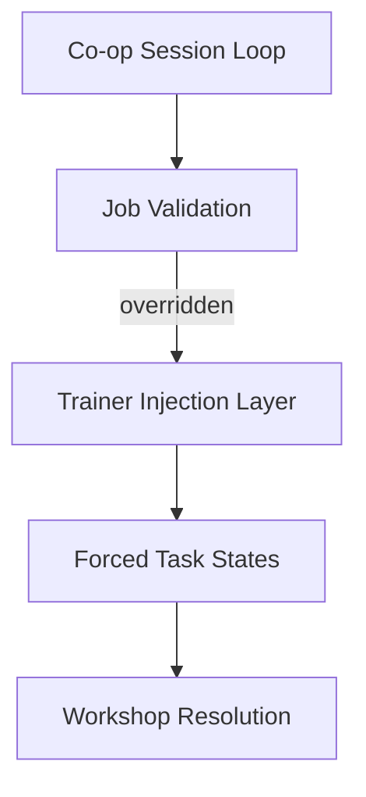

## Overview

Designed as a cooperative simulation control layer, **Car Service Together Trainer** interfaces with the active workshop loop of Car Service Together and alters how service tasks, vehicle states, and multiplayer interactions are evaluated. The trainer does not modify save data or player profiles. Instead, it intervenes at decision points such as repair validation, task completion, time consumption, and resource usage, allowing temporary restructuring of workshop flow while a session is running.

---

## Repair State Enforcement Layer

* Instant repair completion
* Part condition override
* Damage state reset

**Simulation effect:**
Vehicle components resolve as repaired regardless of prior damage or missing steps.

---

## Task and Job Flow Control

* Manual task completion toggles
* Job requirement bypass
* Multi-step service collapse

**System behavior:**
Service jobs advance without enforcing sequential repair dependencies.

---

## Workshop Time Cost Suppression

* Repair duration removal
* Day progression freeze
* Overtime penalty disable

**Simulation effect:**
Actions no longer consume meaningful workshop time unless explicitly allowed.

---

## Economy and Payment Overrides

* Job payout forcing
* Cost deduction suppression
* Shared income normalization

**System behavior:**
Financial transactions resolve successfully even when resource conditions are unmet.

---

## Inventory and Parts Rule Bypass

* Unlimited spare parts usage
* Tool requirement ignore
* Stock depletion disable

**Simulation effect:**
Repair actions proceed as if all required tools and parts are always available.

---

## Vehicle Interaction and Physics Control

* Vehicle movement unlock
* Lift and bay state override
* Collision and placement ignore

**System behavior:**
Workshop interaction constraints are relaxed, allowing non-standard vehicle handling.

---

## Cooperative Session Adjustment

* Shared task ownership override
* Player action conflict bypass
* Session-wide state sync control

**Simulation effect:**
Multiple players can interact with the same job or vehicle without restriction.

---

## Trainer Control Interface

* Role-neutral toggle layout
* Hotkey-driven activation
* Full rule restoration on unload

**System behavior:**
All injected states are reverted cleanly, restoring original cooperative logic.

---

---

## FAQ

**Does the trainer affect multiplayer stability?**
It operates on rule evaluation only and restores defaults on unload.

**Can multiple players complete the same task?**
Yes, task ownership rules can be bypassed.

**Are vehicle repairs permanent?**
All forced repairs revert to normal logic once the trainer is disabled.

**Does it remove tool requirements?**
Tool and part checks can be ignored selectively.

**Can workshop time be restored mid-session?**
Yes, time cost rules can be re-enabled at any moment.

**Is there a full reset option?**
All overridden systems support immediate restoration.

---

## Feature Summary

* Repair and damage state enforcement
* Service task and job flow bypass
* Workshop time cost suppression
* Economy and payout rule overrides
* Inventory and tool requirement removal
* Vehicle interaction constraint relaxation
* Cooperative session rule adjustment
* Session-scoped trainer with clean rollback

---
